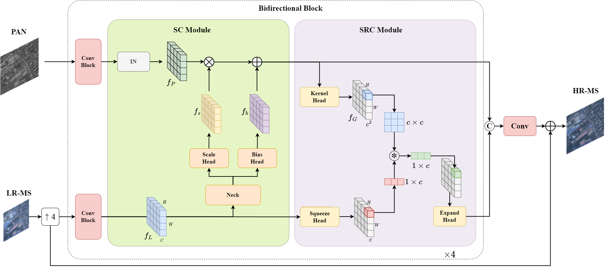

# [Asymmetric Bidirectional Fusion Network for Remote Sensing Pansharpening](https://doi.org/10.1109/TGRS.2023.3296510) (TGRS 2023)

This is the PyTorch implementation of our paper: 

**Asymmetric Bidirectional Fusion Network for Remote Sensing Pansharpening (ABFNet)**

IEEE Transactions on Geoscience and Remote Sensing

[Xin Zhao](https://github.com/zha0x); Jiayi Guo; Yueting Zhang; Yirong Wu




*** 

## Train the Model
1. You need to specific the training configs at [configs](configs) folder
2. train the model using the configs

**demo**
```shell
python train.py -c configs/config_QB.json 
```

*The number of training set should larger than batch size, otherwise the UnboundLocalError: local variable 'loss' referenced before assignment will occur*  

***

## Test the Model

- Test the model on Reduce Resolution

```shell
python test_rr.py -c configs/config_QB.json
```

<!-- - Test the model on Full Resolution
```shell
python test_fr.py -c configs/config_QB.json
``` -->

***

## Citation
If you find this repo is helpful to your research. Please consider cite our work.
```
@ARTICLE{10185614,
  author={Zhao, Xin and Guo, Jiayi and Zhang, Yueting and Wu, Yirong},
  journal={IEEE Transactions on Geoscience and Remote Sensing}, 
  title={Asymmetric Bidirectional Fusion Network for Remote Sensing Pansharpening}, 
  year={2023},
  volume={61},
  number={},
  pages={1-16},
  doi={10.1109/TGRS.2023.3296510}}
```
